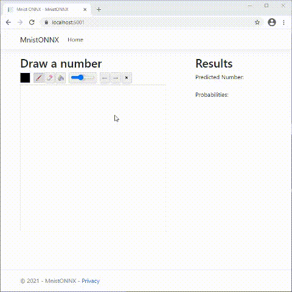

# Mnist-ONNX-CSharp
Digit recognizer in C#/Javascript, with a optional Pickle REST service and an ONNX Mnist Machine learning model for predictions created in Python.

1. Uses [Python code in a Jupyter notebook](MnistONNX/Onnx%20Mnist%20Generator.ipynb) to generate an Mnist machine learning model file in ONNX and Pickle format, with training data from the Mnist Dataset and 5 different algorithms (Logistic Regression, K-Nearest Neighbors, Random Forest, Extremely Random Trees, and a Convolutional Neural Network).
2. Uses [C# code](MnistONNX/Controllers/HomeController.cs) to load that ONNX model into an ML.NET ONNX InferenceSession variable.
3. Uses [Javascript and HTML](MnistONNX/Views/Home/Index.cshtml) to allow users to draw a number in an HTML canvas (drawingboard.js), and have an AJAX call activate the model and try to recognize the correct answer through either a Controller Action with ONNX, or a REST Service with Pickle.
4. Uses [Python code with FLASK](MnistONNX/MnistServer.py)

